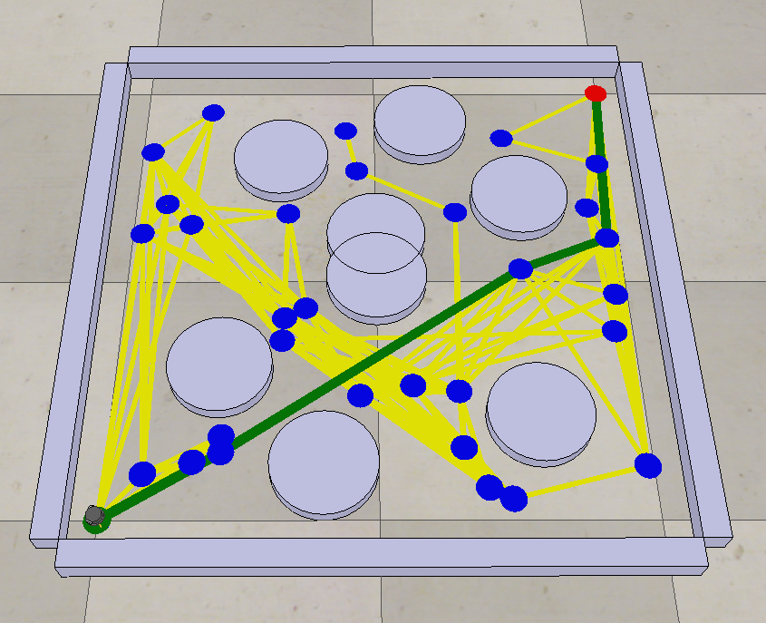
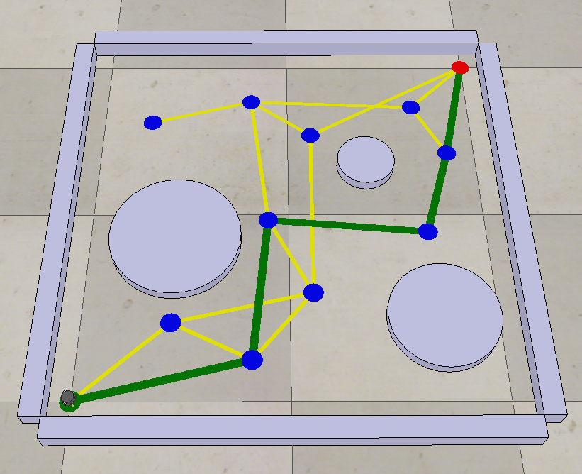

## Sampling-based Planning Alogrithms
Let's learn with [me](https://www.linkedin.com/in/khainx/)

My repository: https://github.com/xkhainguyen/robotics-spec-coursera

In this assignment, I implemented both the two approaches: RRT and PRM planners. The algorithms are straightforward but how to implement them was quite challenging for me at first as I did not know much about data structures. But at the end, I made it.

Program parameters are declared at the beginning, please have a look at it to choose a planner.

Inputs:
- Root 
- Goal
- Obstacles 

Outputs:
- Graph/Tree (nodes, edges)
- Path

Some figures:

